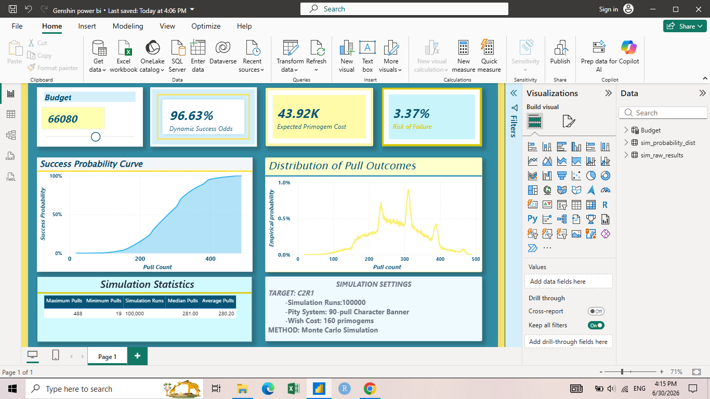

# Monte Carlo Gacha Capital Allocation Simulator

## Overview

This project demonstrates an end-to-end data analytics workflow using **R** and **Power BI**.

A Monte Carlo simulation of **100,000 wishing sessions** was developed in R to model the probability of obtaining a C2R1 target character in Genshin Impact. The generated datasets were imported into Power BI, where an interactive dashboard was built to analyze success probability, expected Primogem expenditure, and failure risk under different budget scenarios.

## Dashboard Preview

## Dashboard Features

- Interactive Primogem budget slider
- Dynamic success probability
- Expected Primogem expenditure
- Failure risk estimation
- Success probability curve
- Pull outcome probability distribution
- Simulation statistics
- Simulation settings

## Technologies Used

- R
- Monte Carlo Simulation
- Power BI
- DAX
- CSV

## Repository Contents

| File | Description |
|------|-------------|
| Genshin Monte Carlo.R | Monte Carlo simulation code |
| Genshin power bi.pbix | Interactive Power BI dashboard |
| sim_raw_results.csv | Raw simulation data |
| sim_probability_dist.csv | Probability distribution data |
| dashboard.png | Dashboard screenshot |

## Skills Demonstrated

- Monte Carlo Simulation
- Statistical Modeling
- Data Visualization
- Business Intelligence
- Probability Analysis
- Risk Analysis
- Forecasting
- DAX
- R Programming

## Future Improvements

- Add multiple target options (C0–C6, R1–R5)
- Compare different player spending profiles
- Include patch planning and long-term Primogem forecasting
- Publish an interactive Power BI report
